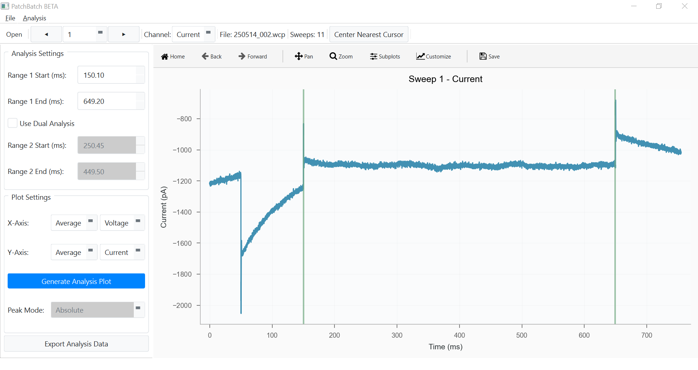

# Summary

Electrophysiology methods such as patch clamp and two-electrode voltage clamp (TEVC) have contributed greatly to our understanding of physiological determinants of disease, such as the role of cardiac sodium channel dysfunction in common arrhythmias that can cause sudden cardiac events. While traditional tools for data acquisition remain valuable to electrophysiology researchers, data analysis throughput is limited by workflows that rely on outdated computational frameworks that can be drastically improved through purpose-built Python automation scripts. PatchBatch was built to standardize and streamline these workflows, greatly reducing time expenditure needed for data analysis. This frees up resources for more important tasks, facilitates greater data output, and makes feasible more exhaustive analysis strategies for electrophysiology researchers specializing in voltage-clamped experiments. 

PatchBatch was built specifically for researchers who use patch clamp and TEVC techniques. It is designed primarily for .wcp files output by WinWCP [@dempster2001], a popular software for recording electrophysiology data, and it seeks to replicate many WinWCP data analysis functionalities, leveraging Python to automate a subset of analysis workflows performed by many electrophysiologists. It is also compatible with .abf formatted data files via pyABF [@pyabf]. This program is intended to be usable by anyone who needs to analyze patch clamp or TEVC data, while not requiring any coding/programming knowledge. Analysis results can be copied or exported to a CSV file for downstream analysis in a dedicated data visualization tool such as Excel or Graphpad Prism. PatchBatch provides a streamlined analysis pathway for dual-channel (Current channel and Voltage channel) data containing repeating Voltage/Current "sweeps", from which scientists extract average or peak signals from a specified temporal region in each sweep. This program is intended to be an intermediate tool that serves as a quick pipeline from raw to processed data that is ready for drop-in integration into a separate application for publication-ready figures. 

# Statement of Need

 Electrophysiology is a broad field of study; domains such as neuroscience have a variety of paid and open-source data analysis tools while others depend on reliable but outmoded tools that rate-limit data processing. One such domain is membrane proteins; ion channels and G-protein coupled receptors are very important determinants of cell biology and their electrophysiological properties have direct implications for innumerable disease etiologies and treatments. Many scientists use patch clamp/TEVC to study such proteins via metrics such as Current-Voltage relationships, concentration-response curves, and channel kinetics. These scientists, especially in academia, rely on tedious data processing methods to study these metrics due to the lack of modern, open-source tools that are oriented for such applications. In many use cases, a data set containing repeated trials of an experiment will be analyzed using the exact same set of analysis parameters. For example, an electrophysiologist may have 20 samples that each need to have the exact same time ranges extracted to perform average Current measurements on. Currently available software requires users to define those time ranges and all other analysis parameters manually for each individual file. This process can be greatly improved by a platform that applies those analysis parameters to all data files simultaneously. Such a platform could then summarize and export that data for import into data visualization tools with full labeling of analysis parameters and individual file names. Further data processing, such as transforming whole-cell currents based on their capacitances, could also be managed in this platform. By automating these steps, electrophysiologists could quickly produce well-formatted, interpretable data from a set of raw data files far more efficiently than currently available methods permit. 

# State of the Field

Programs such as PatchView [@patchview] and SanPy [@sanpy] have been developed to streamline electrophysiology data analysis for specific neuroscience applications. While these applications are conceptually similar to the study of electrophysiology of membrane proteins, there are too many distinctions that prevent their use in this domain. For example, PatchView is designed for multi-patch data, firing pattern analysis, synaptic connection detection, and more. While these are significant capabilities, they are not applicable to all electrophysiology domains. Likewise, SanPy offers a range of impressive, specialized analysis features with very specific applications. Thus, scientists who use patch clamp or TEVC to study electrophysiology of membrane proteins, lymphatic muscle cells, and related areas are still lacking access to more streamlined data analysis tools. Scientists in these domains often rely on the aforementioned WinWCP as well as Clampfit[@clampfit], which remain valuable tools capable of extended data analysis methods, many of which (such as action potential detection) are not currently replicated in this program. However, there remains a significant gap between the automatable potential of patch clamp/TEVC data analysis and the currently available tools for doing so. 

# Software Design

The program is designed to be intuitive to electrophysiologists. In the program's core data analysis pipeline, a raw data file is loaded, an analysis time range per-sweep is set, analysis parameters are set, and the desired calculations are performed and returned. The main focus of the architecture is to apply those same parameters to a larger set, or batch, of raw data files and perform analyses on all of them in one user input. My aim was to build this functionality on the simplest foundation that could achieve it, while remaining extensible for potential later implementation of new processing features, in a GUI accessible to all electrophysiologists. Early in development, it became clear that a stateless, modularized data processing architecture was the optimal design choice to fulfill this aim, enabling batch file analysis while maintaining data integrity and thus the reliability of the software's analysis outputs. The core analysis pathway originated as a single large script, but through development it became necessary to refactor it into a layered service architecture in order to support continued development of the GUI and additional features. The modularity greatly enhances extensibility; new analysis features can typically be added by incorporating a new service script with a new dialog script, importing the program's global themes and settings as needed. More generally, the codebase was designed such that core data processing operations disallow GUI dependencies. This disentangles NumPy data operations from PySide GUI operations and enables GUI-independent testing and verification of the analysis pipeline throughout development. Together, these design principles ensure a reliable final product that users can trust to accurately analyze their data. 

# Research Impact Statement

For one scientist, a day's patch clamp data can take an hour or more to process into a meaningful form. Semi-automating the data analysis process can reduce analysis time to minutes rather than hours. The underlying data processing operations are functionally equivalent to WinWCP; this program simply provides a way to apply the same analysis settings to multiple data files and process them all at once. To my knowledge, no open-source program currently streamlines this process. Additionally, purpose-built features such as batch raw sweep extraction expedite related data processing protocols that are often of interest in electrophysiology. Much like the core analysis process, raw sweep extraction necessitates repetitive identical manual data extraction steps to compare, for example, individual Current sweeps from different recordings, which can be important for characterizing specific types of electrophysiological properties with disease relevance. Labs have traditionally accommodated these inconveniences in data analysis through in-house Python scripts, Excel strategies, or simply through brute force. The batch analysis and related features have saved considerable time for myself and lab mates who have adopted the program. The ability to convert a full day's worth of raw data (12 files) into a plot-ready summary Current-Voltage graph in 2-3 minutes reduces time spent on data analysis by approximately 90% compared to the manual method, which takes 20-30 minutes for the same number of files. Thus, PatchBatch has the potential to markedly reduce time lost to rote data analysis while limiting the chances for user input error during repeated analysis steps.

# AI Usage Disclosure

This software was developed with the aid of large language model (LLM) tools. ChatGPT-4o and Gemini 2.5 were used during early development to produce a basic working prototype. Claude Sonnet 4.0–4.5 and Opus 4.0–4.5 (Anthropic) were used in later development to generate code and refactor the prototype into a user-friendly, fully functional software. All user-facing design decisions were made by the author based on domain expertise in electrophysiology. LLMs aided in the design of the data processing architecture, fine-tuning of the desired analysis modes and GUI features, and troubleshooting coding errors. All code outputs were reviewed and refined by the author for data operations integrity and overall functionality. All analysis scripts were extensively validated by the author by comparing analysis outputs against known reference values (Figure 3). 

LLMs were used to develop pytest scripts to validate all data workflows. Pytests were validated for accurate functionality by the author. Likewise, LLMs were used to script Continuous Integration to run all pytests, and later cross-platform builds, upon each push to GitHub. All build scripts (build_windows.py, build_macos.py, and pyproject.toml) were developed with LLM assistance. Boilerplate documentation (BUILD-INSTRUCTIONS.md, CITATION.cff, CODE_OF_CONDUCT.md, LICENSE.md) were generated with LLM assistance with light refinement by the author. The design principles of ARCHITECTURE.md were written by the author, while the service layer overview was guided by LLM assistance to comprehensively describe the architecture that performs the core analysis workflow. All text of the present document and the vast majority of README.md was written by ther author and formatted with LLM assistance. 

# Figures

Initial window where data sweeps are displayed and analysis ranges defined. Analysis parameters are entered on left-side control panel. The main plot features draggable cursors whose positions are coupled to the input fields in the control panel, enabling fine-tuning of analysis parameters. Users may select one or two time ranges per analysis as needed.

Batch analysis enables rapid output of full dataset, each analyzed by identical parameters. Batch-analyzed data may be exported as a single summary CSV file or several individual CSV files. Data may also be copied to clipboard directly from the program.

Analysis outputs match those of WinWCP. A set of 12 files was analyzed in PatchBatch and in WinWCP, each using identical analysis parameters. Largest discrepancy was 0.05 pA and 0.01 mV for Average Current and Average Voltage measurements respectively.

# References
